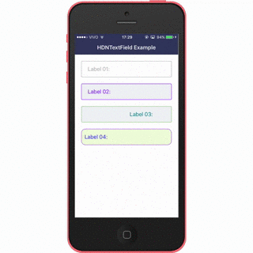
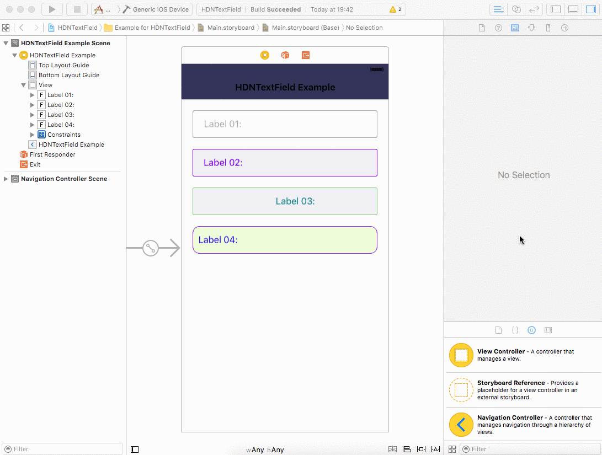

# HDNTextField

[](https://travis-ci.org/hdoria/HDNTextField)
[](http://cocoapods.org/pods/HDNTextField)
[](http://cocoapods.org/pods/HDNTextField)
[](http://cocoapods.org/pods/HDNTextField)
[](https://github.com/Carthage/Carthage)

## Requirements

* iOS 8+

## Example




## How to Use

### Using from Storyboard




To run the example project, clone the repo, and run `pod install` from the Example directory first.

### Code

```swift
let textField = HDNTextField()
```

### Properties

```swift

// This property applies a padding to the placeholder. Ex: CGPoint(x: 10, y: 0).
textField.placeholderInsets = CGPoint(x: 10, y: 0)

// The color for the placeholder when the Textfield is inactive.
textField.placeholderInactiveColor = .lightGrayColor() 

// The color for the placeholder when the Textfield is active.
textField.placeholderActiveColor = .blueColor()

// The background color for the placeholder.
textField.placeholderBackgroundColor = .clearColor()

// The background color for the textfield when it's active.
textField.textFieldActiveBackgroundColor = .clearColor()

//  The background color for the textfield when it's inactive.
textField.textFieldInactiveBackgroundColor = .clearColor() 

// The color for the text when the textfield is inactive.
textField.textInactiveColor = .blackColor() 

// The color for the text when the textfield is active.
textField.textActiveColor: UIColor = .blackColor()

// The corner radius for the textfield as a whole.
textField.textFieldCornerRadius = 3.0

// This property defines the size of the editable area.
textField.textFieldInsets = CGPoint(x: 10, y: 0)

// The color of the border when the textfield is not active.
textField.borderInactiveColor = UIColor.lightGrayColor() 

// The color of the border when it is active.
textField.borderActiveColor: UIColor = UIColor.blueColor() 

```

## Installation

### Using CocoaPods

HDNTextField is available through [CocoaPods](http://cocoapods.org). To install
it, simply add the following line to your Podfile:

```ruby
pod "HDNTextField"
```

### Using Carthage

Add the following to your Cartfile:

```bash
github "hdoria/HDNTextField"
```

## Author

Hugo Doria, hugo@hdoria.me

## License

HDNTextField is available under the MIT license. See the LICENSE file for more info.
